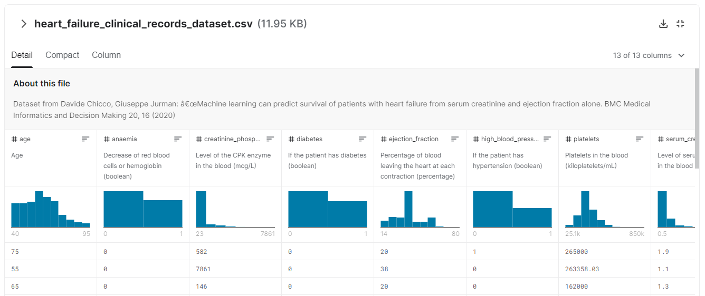
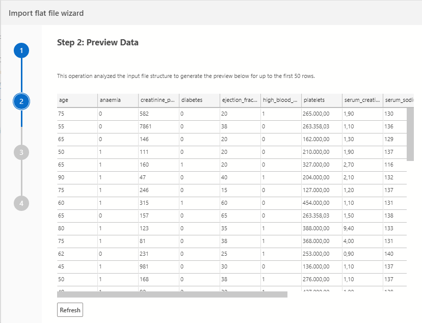
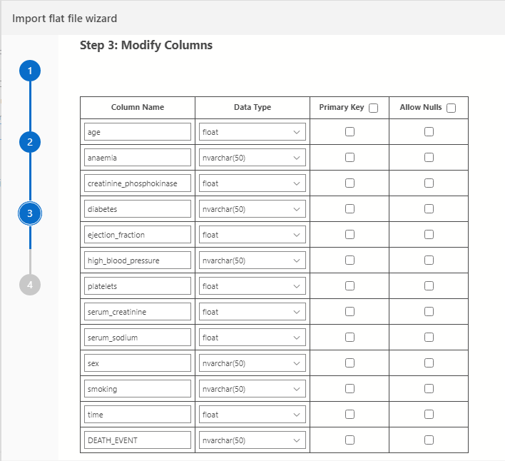
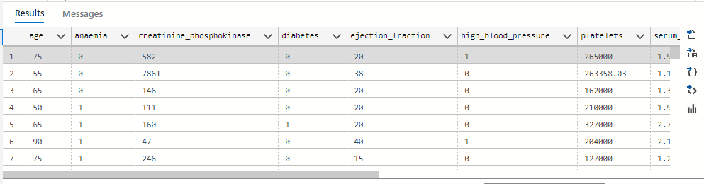
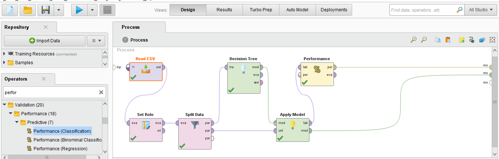
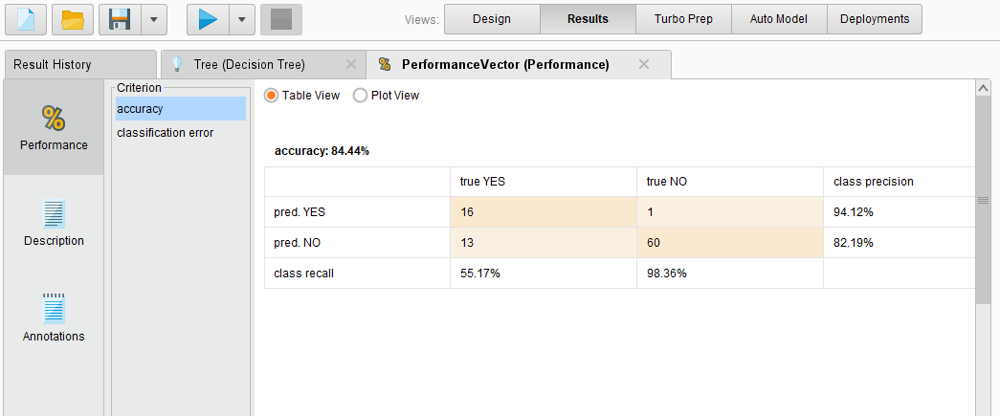
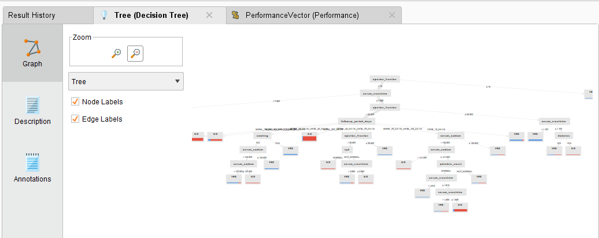

# Exercício principal

Analisar um conjunto de dados utilizando alguma das ferramentas apresentadas na disciplina, preocupando-se com as etapas para mineração de dados.

## Heart Failure Prediction

O conjunto de dados utilizados do [Kaggle](https://www.kaggle.com): [Heart Failure Prediction](https://www.kaggle.com/andrewmvd/heart-failure-clinical-data/code). Apresenta 299 casos de situações de insuficiência cardíaca com o evento de falecimento ou não.



## Etapas

### Importação dos dados

> O arquivo .csv do Kaggle foi ajustado no Google Planilhas para substituir o `.` por `,` devido a etapa de importação no SQL Server em português.

O .csv ajustado foi importado no banco SQL Server através do [Azure Data Studio](https://docs.microsoft.com/pt-br/sql/azure-data-studio/download-azure-data-studio?view=sql-server-ver15).



As colunas foram ajustadas da seguinte maneira:



### Tratamento dos dados

Foram realizados algumas modificações na base de dados:

```sql
UPDATE heart_failure
SET anaemia = CASE
        WHEN anaemia = '0' THEN 'NO'
        WHEN anaemia = '1' THEN 'YES'
    END,
    diabetes = CASE
        WHEN diabetes = '0' THEN 'NO'
        WHEN diabetes = '1' THEN 'YES'
    END,
    high_blood_pressure = CASE
        WHEN high_blood_pressure = '0' THEN 'NO'
        WHEN high_blood_pressure = '1' THEN 'YES'
    END,
    smoking = CASE
        WHEN smoking = '0' THEN 'NO'
        WHEN smoking = '1' THEN 'YES'
    END,
    DEATH_EVENT = CASE
        WHEN DEATH_EVENT = '0' THEN 'NO'
        WHEN DEATH_EVENT = '1' THEN 'YES'
    END,
    sex = CASE
        WHEN sex = '0' THEN 'F'
        WHEN sex = '1' THEN 'M'
    END;

ALTER TABLE heart_failure
ADD followup_period_days NVARCHAR(50);
UPDATE heart_failure
SET followup_period_days = CASE
        WHEN [time] <= 15 THEN 'UNTIL_15_DAYS'
        WHEN [time] > 15
        AND [time] <= 45 THEN 'MORE_15_DAYS_UNTIL_45_DAYS'
        WHEN [time] > 45
        AND [time] <= 75 THEN 'MORE_45_DAYS_UNTIL_75_DAYS'
        WHEN [time] > 75
        AND [time] <= 100 THEN 'MORE_75_DAYS_UNTIL_100_DAYS'
        WHEN [time] > 100
        AND [time] <= 150 THEN 'MORE_100_DAYS_UNTIL_150_DAYS'
        WHEN [time] > 150
        AND [time] <= 200 THEN 'MORE_150_DAYS_UNTIL_200_DAYS'
        WHEN [time] > 200 THEN 'MORE_200_DAYS'
    END
ALTER TABLE heart_failure
ADD age_group NVARCHAR(50);
UPDATE heart_failure
SET age_group = CASE
        WHEN age <= 40 THEN 'YOUNG ADULTS'
        WHEN age > 40
        AND age <= 60 THEN 'MIDDLE-AGED ADULTS'
        WHEN age > 60 THEN 'OLD ADULTS'
    END
ALTER TABLE heart_failure
ADD cpk NVARCHAR(50);
UPDATE heart_failure
SET cpk = CASE
        WHEN creatinine_phosphokinase >= 39
        AND creatinine_phosphokinase <= 308 THEN 'NORMAL'
        ELSE 'NOT_NORMAL'
    END
WHERE sex = 'M'

#CPK blood tests the different forms of CPK in the bloodstream and the CPK normal range varies from a male to female.
# The CPK normal range for a male is between 39 – 308 U/L, while in females the CPK normal range is between 26 – 192 U/L.

UPDATE heart_failure
SET cpk = CASE
        WHEN creatinine_phosphokinase >= 26
        AND creatinine_phosphokinase <= 192 THEN 'NORMAL'
        ELSE 'NOT_NORMAL'
    END
WHERE sex = 'F'

# A normal platelet count ranges from 150,000 to 450,000 platelets per microliter of blood.
ALTER TABLE heart_failure
ADD platelets_count NVARCHAR(50);
UPDATE heart_failure
SET platelets_count = CASE
        WHEN platelets >= 150000
        AND platelets <= 450000 THEN 'NORMAL'
        ELSE 'NOT_NORMAL'
    END
```

Os dados abaixo selecionados foram exportados para .csv para serem importados pela ferramenta [RapidMiner](https://rapidminer.com/)

```sql
SELECT TOP (1000) [anaemia],
    [cpk],
    [diabetes],
    [ejection_fraction],
    [high_blood_pressure],
    [platelets_count],
    [serum_creatinine],
    [serum_sodium],
    [sex],
    [smoking],
    [DEATH_EVENT],
    [followup_period_days],
    [age_group]
FROM [POS].[dbo].[heart_failure_1]
```


### Utilizando árvore de decisão

O csv com os dados tratados foram importados na ferramenta RapidMiner e foi utilizado o modelo de árvore de decisão e a divisão de dados em 70% (treinamento) e 30% (testes).





